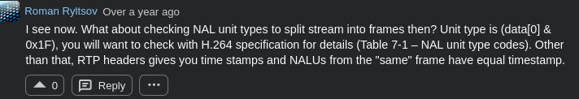
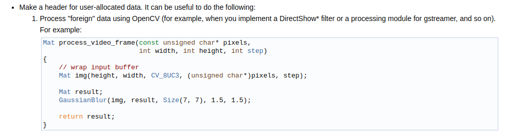

ocessing on laptop. (rtmp server)
See also: OBS Studio, OBS Camera for IOS (both open source)


- The unknowns have got to be video data. 
- There are some chunk IDs. See rtmp intro for meaning.
- Larix client strips the rtmp connection URL to the IP and port of the server
(which are set manually), and very likely does a simple TCP connect() to server IP:port, 
followed by the rtmp handshake with server


#### Misc
##### Endianness and Network Byte Order
- Recall endianness is a property of the ISA. Defined by how the CPU’s load/store instructions   
assemble or disassemble bytes when moving data between memory and registers.    
```
// Example: LOAD16 R0, [0x1000], i.e. pseudocode for
// loading 2 bytes at address 0x1000 into some register.

// In a little-endian ISA such as x86, the 
// actual instruction would be something like:
// store the 2-byte value at address 0x1000 in register AX
// i.e. mov eax [0x1000] 
// CPU implements this instruction via:
// ax = mem[0x1000] + (mem[0x1001] << 8) (0x0018 + 0x0022 << 8 = 0x2200)
//
// In the corresponding situation with a big-endian
// ISA, the CPU would perform:
// i.e. the value is as if the MSB is on the extreme left
// of the 2-byte sequence.
// R0 = (mem[0x1000] << 8) + mem[0x1001]
``` 
The network: Transmits bytes in some sequence.  
Network order: For multi-byte integers, the most significant BYTE (not bit) appears first in the stream.  
`htons`:  
```
uint16_t x = 0x1822;      // host-order value (may be used on a LE or BE ISA).
// On a little-endian system, htons() swaps the bytes of the value
// so that when the value is stored and transmitted, the most significant BYTE (not bit) is sent first.
// On little-endian: y == 0x2218
//
// On a big-endian system, htons() does nothing
// On big-endian: y == 0x1822
uint16_t y = htons(x);   // value transformed
```

#### Build
```
cmake -S /home/armaan/Fun-CS/Squig/submodules/EasyRTMP -B /home/armaan/Fun-CS/Squig/submodules/EasyRTMP/build
// add -DUSE_OPENSSL ON to enable openssl
// build as .ar is better, small size, good for embedded to (in case I build custom clients)

cmake --build /home/armaan/Fun-CS/Squig/submodules/EasyRTMP/build

doxygen Doxyfile : generates index.html for docs, open in browser.
```

@9 jan
https://doc.qt.io/qt-6/qvideoframe.html
Build a base gui to render the received video frames.

https://en.wikipedia.org/wiki/Real-Time_Messaging_Protocol
- Single view playback

Larix android video codec: AVC (H.264)
Larix IOS video codec: also AVC (H.264)

Q. Does EasyRTMP recreate frames? Answer NO.
RTMP messages contain encoded frames, need to decode.
- Does every RTMP message carry a single encoded frame in its payload? Likely NO.  
Actually, it seems like yes. A `VideoPacket` is an encoded frame. See rtmp_proto.h
Need to send videopackets to avc_decode.
- Actually, not quite. The videopacket data may contain several NAL units, i

Identifying Frames: https://stackoverflow.com/questions/3493742/problem-to-decode-h264-video-over-rtp-with-ffmpeg-libavcodec

https://stackoverflow.com/questions/58469017/libavcodec-initialization-to-achieve-real-time-playback-with-frame-dropping-when

https://github.com/leandromoreira/ffmpeg-libav-tutorial

https://archive.is/OrGfg : libavcodec audio decoding

https://www.ffmpeg.org/doxygen/trunk/group__lavc__decoding.html#ga58bc4bf1e0ac59e27362597e467efff3

Pipeline: Larix (RTMP packet) -> libav (decode AVC to get frames) -> ??QTMultimedia for playing frames?? 

https://stackoverflow.com/questions/6756770/libavcodec-how-to-tell-end-of-access-unit-when-decoding-h-264-stream



How many NALU units in a frame?
https://stackoverflow.com/questions/28559529/how-to-know-the-number-of-nal-unit-in-h-264-stream-which-represent-a-picture

@14 Jan
Investigate: 
- In a 96 RTMP message capture, 140ish packets are sent to the interface.  
- Addtionally, the rtmp packets have different chunk stream ids in wireshark  
- How is wireshark timestamps calculated?
- In pause mode, packets are still being sent by larix. Timestamps are also incremented normally, by ~33 units each RTMP message...


#### Github Stuff
Submodules workflow:
- Commit in submodule directory, then push
- git add deps/<name>
- Commit in root directory, then push


384 messages ~ 486-533 packets
96 messages ~

@15Jan
https://stackoverflow.com/questions/19191717/how-to-continuously-extract-video-frames-from-streaming-rtmp-using-avconv-ffmp
- Go through the ffmpeg source code. Apparently `ffmpeg -i <URL> -r 1 out%03d.jpg` generates jpg every second from RTMP stream.
- Need to create a VideoData object somehow.
FFMPeg API tutorial: http://www.dranger.com/ffmpeg/tutorial01.html

Extracting frames from an RTMP stream:  
There seem to be 3 methods,  
- [Ref](https://stackoverflow.com/questions/30096327/opencv-wont-capture-frames-from-a-rtmp-source-while-ffmpeg-does?rq=3) OpenCV can extract frames from an RTMP source url (uses ffmpeg). Is this URL of the Larix client on iOS or of my server on machine?
- FFMpeg CLI can generate .jpg every unit time given an rtmp URL. Again, which URL is this? I suspect server URL, but how would ffmpeg get the frames?
- The third method is using the base ffmpeg libraries in Squig for live frame extraction rather than depending on OpenCV.

Strategy: For any problem, before re-inventing any existing functionality, you must be able to demostrate 
that standard solutions are inadequate. In other words:  
Problem: Extracting frames from a live RTMP stream  
S0: Larix Client -> Nginx-rtmp -> VLC [ref1](https://github.com/aileone/nginx-rtmp-module/issues/1), [ref2](https://obsproject.com/forum/resources/how-to-set-up-your-own-private-rtmp-server-using-nginx.50/#:~:text=Restart%20nginx%20with:,web%20site%20you%20set%20up.)
- This is alright for playback/rtmp demo, but its difficult to integrate OpenCV/vision algorithms into nginx server...
S1: Using ffmpeg command line (Just to demonstrate, obviously not suited to realtime processing.)  
S2: Using OpenCV libraries (Might be viable)  
S3: Using libav* libraries directly in Squig (If OpenCV inadequate) 

@21 Jan
Observed 5ish second delay between motion capture on ios camera and playback on 
laptop in the larix->nginx->vlc pipeline. 
TASK: Characterize the delays. This is important to generate a baseline for future
latency comparisons

Expt: larix keyframe frequency: 
Default 2s, tried 1s, no effect on trmp message rec timestamps and # of messages. 


H.264 keyframe interval, iframe, etc...  
https://streaminglearningcenter.com/codecs/beginners-guide-to-encoding-h264.html


@23Jan
TODO: Display a video frame. To test, send data using an RTMP client.
    // Read input media file 
    // (for a true client this is camera stream)
    // cant ffmpeg just do this? 
    // it can.

SOLUTION: Just use ffmpeg command line to stream rtmp.


@24Jan
Opencv Wiki: https://github.com/opencv/opencv/wiki/FAQ
Opencv Full Docs: https://docs.opencv.org/4.x/index.html
- [ ] Pass cv::Mat objects to functions. Each video frame must
be converted to a cv::Mat. Internally these are converted to InputArray 
and OutputArray



@25jan
From the rtmp  video_data_send hexdumps, there dont seem to be any
NALU start codes...Gives more evidence that the video_data is pure NAL data
- So does that mean byte 1 of the sequence would give the NALu type?
Observed:
- Keyframe videodata starts with 00 01, other frames (interframes) are 00 00 
!!! These are in the AVCC (packet-based) format, NOT the byte-stream
See: https://stackoverflow.com/questions/24884827/possible-locations-for-sequence-picture-parameter-sets-for-h-264-stream
The first rtmp message is the AVCC (AVCDecoderCOnfigurationRecord!!!), has structure
as in above link!!! i.e. it is the extradata header.

- Subsequent messages, the videodata_send field contain 4byte length of NALU followed by NALU bytes.
- video_data_send: bytes [0-3]: bytes in the raw video data (NALu). byte 4: (first byte of the raw data): NALU type. Here, i observe only 0x01 and 0x41, i.e. 0000 0001, 0100 0001
- The ITU spec section 7.3.1 gives the syntax - 
0x41	0100 0001	1 (Slice)	P-Frame (Referenced). Used to predict future frames.
0x01	0000 0001	1 (Slice)	B-Frame (Disposable). Not used for prediction- 

These NAL types are the ones corresp. to the table in SO link above.

@26Jan
- av_send_packet() expects a byte-stream rather than AVCC. Methods
look for start code, but the NALUs in video_data_send are cleaned from AVCC 
https://aviadr1.blogspot.com/2010/05/h264-extradata-partially-explained-for.html
https://aviadr1.blogspot.com/2011/04/media-processing-pipeline.html


video_data_send.size() is 54039 bytes, 
but the buffer is an AVCC format, and first 4 bytes corresp to the size of nalu
and the 5th byte corresp to the type of nalu (0x06 = SEI). Observe that 
for rtmp message 1, payload = 54039 bytes, but nalu size = 0000 02 af = 687.
- 06 tells that we have a 687 byte SEI nalu at the start of the first rtmp
video_data buffer.
- This means that there are more nalus in the remaining video_data_send
- THIS ALSO STRONGLY SUGGESTS that each video_data_send in the rtmp message
  is an Access Unit, i.e.  all the info needed to create a single frame.
> it seems like i would have to (for the entire video_data_send)  jump the bytes = size of prev NALU make the 4 subsequent bytes a nalu start code (while recording the size of this nalu) and iterate until I have written start codes for each nalu... (replacing the lengths)

@27 Jan
https://stackoverflow.com/questions/49449411/how-to-use-av-frame-unref-in-ffmpeg
gdb catch throw to set breakpoint on thrown exception
https://github.com/leandromoreira/digital_video_introduction

Digital Colour models: 
- RGB (red,green,blue) - 3 planes for each 2D pixel frame. Each pixel is rep by a 24 bit value,
8 bits for each of RGB. 
- YUV/YCbCr (Luma (luminance) - brightness, chroma (chrominance) - colours blue, red). Used
to reduce space requirements for storing colour images, and also mainitnang pereviced quality
using a quirk of the huan eye.


In analog transmission
Every video frame is divided into ~500 horizontal "lines", each line
spans the width of the frame.
- Every line has an associated luma signal - a contious curve repping the "brightness"
of the region as we move in the horizontal direction. Y-axis of luma curve: Black to white, 
mids are grey. For BW TV, pure LUMA transmission was suffcient.
- LUMA = weighted sum of the rgb values of a colour, i.e. a value for brightness,
with green weighted higher than red and blue due to human eye sensitivy
- For colour TV, the colour signal is called "Chroma"
Luma + Chroma -> Colour Video
https://learnopencv.com/why-does-opencv-use-bgr-color-format/

av_pix_fmt_descriptors[AV_PIX_FMT_NB] 
also see pixfmt.h

htop:
VIRT: Total mem requested by the proc (why is this some megabytes??)  - remember easyrtmp is statically linked.
RES: total mem _in_use_ by the proc
SHR: mem shareable.
Use `man top`
filter processes by F4
  
OK first E2E playback done after fixing memory leaks.

tests:
- squig +larix is lower latency that nginx-rtmp (almost zero lag vs 4-5s lag), but squig server video is kinda choppy, blurred while nginx+vlc 
pipeline video is much clearer. Not sure what the reason could be...

Memory Footprint:
Squig+Larix:
VIRT:2180M, RES: 171M, SHR: 125M, CPU:~20%

Nginx-RTMP+VLC+Larix:
VIRT: 5900M, RES: 181M, SHR: 114M, CPU: ~22%

@28 Jan
- Online RL training classifier hard, unfeasible (aditya TBs of data). Corner inference difficult with monocular
- Tracking, Occlusion detection, point classification seems doable with monocular.

    - 2 camera setup may be necessary for better infernece.

@29Jjan
Need to seperate video display cv::imshow from stream decode.
- two seperate threads: producer writes cv::Mat
- consumer displays the ~latest frames:
Buffering schemes: See Double Buffer
    https://brilliantsugar.github.io/posts/how-i-learned-to-stop-worrying-and-love-juggling-c++-atomics/
https://medium.com/%40sgn00/triple-buffer-lock-free-concurrency-primitive-611848627a1e

Timing info:
- A Frame must be displayed every 33.3ms for 30fps video
- If a frame is passed to cv::imshow() before 33.3ms, it likely holds frame before painting, to ensure display at the correct stamp
- p99 latency is a useful measure to decide if we need better architecture.
